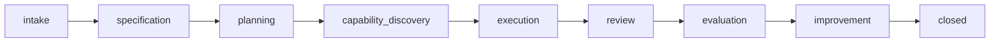

# claude-config

Global Claude Code configuration repository synced across machines. Provides custom VS Code agents, slash commands, skill packages, and a **governed Multi-Agent System (MAS)** that coordinates 14 specialized AI agents through formal protocols for end-to-end project delivery.

---

## Table of Contents

- [Quick Start](#quick-start)
- [Directory Structure](#directory-structure)
- [Multi-Agent System (MAS)](#multi-agent-system-mas)
  - [Agent Network](#agent-network)
  - [Project Lifecycle](#project-lifecycle)
  - [Core Modules](#core-modules)
  - [Governance](#governance)
  - [Shared State](#shared-state)
  - [Consultation System](#consultation-system)
  - [Communication Optimization](#communication-optimization)
  - [LLM Configuration](#llm-configuration)
- [Skills](#skills)
- [Commands](#commands)
- [CLI Reference](#cli-reference)
- [Testing](#testing)
- [Human Escalation Triggers](#human-escalation-triggers)
- [Adding New Agents or Skills](#adding-new-agents-or-skills)

---

## Quick Start

### Prerequisites

- Python 3.11+
- [uv](https://docs.astral.sh/uv/) package manager
- Claude Code (VS Code extension)

### Setup (per machine)

```powershell
# Windows (PowerShell as Administrator)
.\setup.ps1

# macOS / Linux
./setup.sh
```

This creates symlinks so `agents/`, `commands/`, and `skills/` are globally available in Claude Code:

| Local Path | Symlink Target |
|------------|----------------|
| `agents/` | `~/.claude/agents/` |
| `commands/` | `~/.claude/commands/` |
| `skills/` | `~/.claude/skills/` |

### Run a MAS project

All `uv run` commands must be executed from this repo root (where `pyproject.toml` lives).

```bash
uv run mas init session-scheduler   # Start a new project
uv run mas status <project-id>      # Check project phase
uv run mas roster                   # List all agents
```

---

## Directory Structure

```
claude-config/
├── CLAUDE.md              # Agent instructions (loaded by Claude Code)
├── README.md              # This file
├── pyproject.toml         # Python package config (MAS)
├── setup.ps1              # Windows symlink setup (run as Admin)
├── setup.sh               # macOS/Linux symlink setup
│
├── agents/                # Custom Claude Code agents (14 MAS agents + utilities)
│   ├── master_orchestrator.md
│   ├── scribe_agent.md
│   ├── hr_agent.md
│   ├── inquirer_agent.md
│   ├── product_manager_agent.md
│   ├── project_manager_agent.md
│   ├── evaluator_agent.md
│   ├── trainer_agent.md
│   ├── spawner_agent.md
│   ├── risk_advisor.md
│   ├── quality_advisor.md
│   ├── devils_advocate.md
│   ├── domain_expert.md
│   ├── efficiency_advisor.md
│   ├── session_scheduler.md
│   └── _utilities.md
│
├── commands/              # Custom slash commands
│   └── resume-mas.md      # Resume a paused MAS project
│
├── skills/                # Skill packages
│   ├── frontend-design/
│   ├── notebooklm/
│   ├── research-extract/
│   ├── research-sync/
│   └── skill-builder/
│
└── mas/                   # Multi-Agent System engine
    ├── CLAUDE.md
    ├── system_config.yaml
    ├── core/              # 20 Python modules
    ├── domains/           # Domain context files
    ├── foundation/        # Protocol & schema specs
    ├── policies/          # 6 governance YAML files
    ├── projects/          # Project workspaces
    ├── roster/            # Agent/skill registrations
    ├── templates/         # YAML templates
    └── tests/             # Test suite (653 tests)
```

---

## Multi-Agent System (MAS)

Version **0.1.0**. A governed multi-agent delivery system that coordinates 14 specialized AI agents through formal handoff protocols, access-controlled shared state, and policy enforcement.

**Key dependencies**: `anthropic>=0.49.0`, `pyyaml>=6.0`, `python-dotenv>=1.0`, `click>=8.1`, `rich>=13.0`, `networkx>=3.0`

### Agent Network

14 agents organized across 4 trust tiers:

```
┌─────────────────────────────────────────────────────────────────┐
│  T0 CORE (highest trust)                                        │
│  ┌──────────────────────┐  ┌────────────┐  ┌──────────┐        │
│  │ master_orchestrator  │  │   scribe   │  │    hr    │        │
│  │ (Opus · coordination │  │ (docs,     │  │ (roster, │        │
│  │  governance, phases) │  │  audit)    │  │  gaps)   │        │
│  └──────────────────────┘  └────────────┘  └──────────┘        │
├─────────────────────────────────────────────────────────────────┤
│  T1 ESTABLISHED (independent specialists)                       │
│  ┌───────────┐ ┌─────────────┐ ┌─────────────┐ ┌───────────┐  │
│  │ inquirer  │ │  product_   │ │  project_   │ │ evaluator │  │
│  │ (intake,  │ │  manager    │ │  manager    │ │ (metrics, │  │
│  │  Q&A)     │ │ (MoSCoW,   │ │ (tasks,     │ │  scoring) │  │
│  │           │ │  scope)     │ │  milestones)│ │           │  │
│  └───────────┘ └─────────────┘ └─────────────┘ └───────────┘  │
├─────────────────────────────────────────────────────────────────┤
│  T1 CONSULTANT PANEL (advisory · invoked for high-impact)       │
│  ┌──────────┐ ┌──────────┐ ┌──────────┐ ┌────────┐ ┌────────┐ │
│  │   risk   │ │ quality  │ │ devil's  │ │ domain │ │ effic. │ │
│  │ advisor  │ │ advisor  │ │ advocate │ │ expert │ │advisor │ │
│  └──────────┘ └──────────┘ └──────────┘ └────────┘ └────────┘ │
├─────────────────────────────────────────────────────────────────┤
│  T2 SUPERVISED (require Master oversight)                       │
│  ┌───────────┐  ┌───────────┐                                   │
│  │  trainer  │  │  spawner  │                                   │
│  │ (L0 advise│  │ (agent    │                                   │
│  │  only)    │  │  design)  │                                   │
│  └───────────┘  └───────────┘                                   │
├─────────────────────────────────────────────────────────────────┤
│  T3 PROVISIONAL (sandbox · spawned agents, none currently)      │
└─────────────────────────────────────────────────────────────────┘
```

| Tier | Agent | Role |
|------|-------|------|
| **T0** | `master_orchestrator` | Overall coordination, governance, delegation, phase management, spawn approval |
| **T0** | `scribe_agent` | Documentation, record-keeping, decision logging, artifact tracking, audit trail |
| **T0** | `hr_agent` | Capability discovery, roster management, gap certification, agent registration |
| **T1** | `inquirer_agent` | Intake, requirements elicitation, clarification Q&A |
| **T1** | `product_manager_agent` | Product planning, MoSCoW prioritization, acceptance criteria, scope definition |
| **T1** | `project_manager_agent` | Execution planning, task decomposition, milestone tracking, dependency mapping |
| **T1** | `evaluator_agent` | Performance evaluation, metric scoring, pattern detection |
| **T1 Consultant** | `risk_advisor` | Risk analysis, failure mode analysis, mitigation planning, blast radius |
| **T1 Consultant** | `quality_advisor` | Quality review, completeness check, testability assessment |
| **T1 Consultant** | `devils_advocate` | Assumption challenging, alternative perspectives, blind spot detection |
| **T1 Consultant** | `domain_expert` | Domain knowledge, best practices, prior art (auto-injects from `mas/domains/`) |
| **T1 Consultant** | `efficiency_advisor` | Overengineering detection, cost estimation, simplification |
| **T2** | `trainer_agent` | Improvement proposals, pattern detection (L0 advisory only) |
| **T2** | `spawner_agent` | Agent design, capability packaging, draft generation |

### Project Lifecycle



Each phase transition requires:
1. Exit criteria verification by Master
2. Shared state snapshot
3. Phase recording in state

**Project IDs** follow the format: `proj-{YYYYMMDD}-{NNN}-{slug}` (e.g., `proj-20260410-001-session-scheduler`). Each project gets a standardized folder structure created by Scribe.

### Core Modules

20 Python modules in `mas/core/`:

| Module | Purpose |
|--------|---------|
| `cli.py` | Top-level CLI entry point (`uv run mas`) |
| `config.py` | System configuration loader |
| `shared_state_manager.py` | Project state, access control, snapshots |
| `handoff_engine.py` | Handoff creation, acceptance, compact wire format |
| `consultation_engine.py` | Consultation lifecycle, synthesis, compact format |
| `intake_checker.py` | Spec quality scoring (threshold ≥ 0.85) |
| `capability_registry.py` | Roster, gap certificates, match scoring |
| `task_board.py` | Milestones, tasks, dependency chains |
| `metrics_engine.py` | Project + agent scoring, evaluation reports |
| `spawn_policy.py` | Spawn validation, agent package builder |
| `training_engine.py` | Proposal generation, backlog management |
| `access_control.py` | Field-level write permissions |
| `audit_logger.py` | Structured YAML event logging |
| `message_bus.py` | Inter-agent messaging |
| `prompt_assembler.py` | State projection and prompt building with lean injection |
| `checkpoint_writer.py` | Human-readable project checkpoints |
| `token_counter.py` | Heuristic/tiktoken token estimation |
| `wire_protocol.py` | Compact wire format for handoff payloads |
| `skill_bridge.py` | Agent-to-skill gateway with authorization matrix |
| `graph_memory.py` | Graph-based relationship memory |

### Governance

Six YAML policy files in `mas/policies/` enforce all system rules:

| Policy | Key Rules |
|--------|-----------|
| **governance_policy.yaml** | Reuse before create · document before forget · improve only through evidence · violations blocked pre-execution · 3 violations → human escalation |
| **handoff_protocol.yaml** | Structured handoff records (identity, parties, context, payload, acceptance status) |
| **trust_tier_policy.yaml** | 4 tiers (T0–T3) with promotion requirements: evaluator verification + zero violations + human approval |
| **spawn_policy.yaml** | Gap cert + Master approval + consultant review · max 3/project · max 1/phase · no recursive spawning |
| **evaluation_policy.yaml** | Metrics: goal achievement, acceptance pass rate, handoff acceptance, doc completeness, boundary violations · Probation <60, Exemplary >90 |
| **training_policy.yaml** | L0 advisory → L1 supervised → L2 autonomous · proposals need ≥1 evaluation report |

#### Trust Tier Promotions

- **T3 → T1**: Evaluator verification + zero governance violations + human approval
- **Trainer L0 → L1**: 3 successful projects + human review + zero violations
- **Trainer L1 → L2**: 5 successful L1 cycles + human approval

### Shared State

Each project has a single source of truth (`shared_state.yaml`) with access-controlled sections:

| Section | Contents |
|---------|----------|
| `core_identity` | project_id, phase, status (immutable after creation) |
| `project_definition` | brief, spec, goal, scope, constraints, success/acceptance criteria, risk classification |
| `workflow` | active agents, completed phases, handoff history, resource requests |
| `decisions` | decision log, assumptions, open questions, approvals, policy flags |
| `capability` | available skills, gap certificates, spawn requests |
| `artifacts` | documents, deliverables, change log |
| `evaluation` | performance metrics, quality findings, improvement proposals |
| `communication` | token tracking, wire compliance counters |
| `consultation` | consultation requests and responses |
| `execution` | tasks and milestones |

All fields have `set_by` (owner), `mutability` rules, and type definitions. **No agent may write to fields it doesn't own.**

### Consultation System

The 5-member consultant panel (`risk_advisor`, `quality_advisor`, `devils_advocate`, `domain_expert`, `efficiency_advisor`) is always invoked for:
- Spawn requests
- Scope changes
- Governance decisions
- Escalations
- Architecture decisions

**Hard stop**: If all 5 consultants return "high" risk → human escalation required. Master cannot override unanimous high-risk without human approval.

### Communication Optimization

- **Compact wire format**: `HandoffEngine.compact()`/`expand()`, `ConsultationEngine.compact_request()`/`expand_request()`
- **Token counter**: Heuristic and tiktoken backends
- **Wire protocol validation** for payload compliance
- **Skill bridge** with per-agent access control matrix
- **Graph memory** for relationship tracking
- **Communication efficiency metrics** in evaluation (half-weight): token efficiency, payload density, context injection efficiency, consultation overhead, wire compliance

### Memory Types

| Type | Scope | Lifetime | Notes |
|------|-------|----------|-------|
| Working state | Task/phase | Ephemeral | Archived at phase completion |
| Project memory | Per project | Durable | Written by Scribe only, never deleted |
| Roster memory | System-wide | Durable | Agent/skill/tool definitions |

### LLM Configuration

| Agent | Model | Max Tokens | Temperature |
|-------|-------|------------|-------------|
| `master_orchestrator` | `claude-opus-4-6` | 4096 | 0.3 |
| All others | `claude-sonnet-4-6` | 4096 | 0.3 |

### Domain Contexts

Markdown files in `mas/domains/` auto-injected into `domain_expert`:

- `software_engineering.md`
- `data_science.md`
- `content_creation.md`
- `research.md`

---

## Skills

| Skill | Description |
|-------|-------------|
| `frontend-design` | Frontend design patterns and guidance |
| `notebooklm` | NotebookLM integration (auth, scripts, data) |
| `research-extract` | Research extraction workflows |
| `research-sync` | Research synchronization |
| `skill-builder` | Skill creation toolkit |

---

## Commands

| Command | Description |
|---------|-------------|
| `resume-mas` | Resume a paused MAS project |

---

## CLI Reference

All commands run from repo root via `uv`:

```bash
uv run mas init <slug>           # Initialize new project
uv run mas status <project-id>   # Current phase, owner, pending handoffs
uv run mas state <project-id>    # Full shared state dump
uv run mas pending <project-id>  # Unresolved handoffs
uv run mas snapshot <project-id> # Snapshot at current phase
uv run mas roster                # All registered agents
```

---

## Testing

```bash
uv run pytest mas/tests/              # Full suite (653 tests)
uv run pytest mas/tests/unit/         # Unit tests
uv run pytest mas/tests/integration/  # Integration tests
uv run pytest mas/tests/governance/   # Access control & immutability
uv run pytest mas/tests/prompts/      # Agent prompt tests
```

End-to-end lifecycle test: `mas/tests/integration/test_full_lifecycle.py`

---

## Human Escalation Triggers

The system forces human intervention when:

- Risk classification is "critical"
- Unresolvable consultant concern
- Two consecutive spawn denials
- Phase blocked after retry
- Unanimous high-risk from all 5 consultants
- Master needs to override unanimous recommendation
- Trust tier promotion, governance policy change, or trainer promotion

---

## Adding New Agents or Skills

- **Agent**: Create `agents/{name}.md` with frontmatter (`name`, `description`, `tools`)
- **Skill**: Create `skills/{name}/SKILL.md`
- **Command**: Create `commands/{name}.md`
- Push to GitHub — other machines pull to sync
